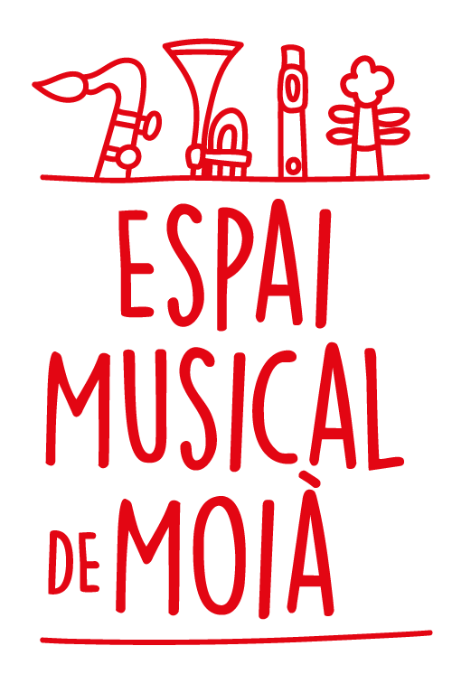
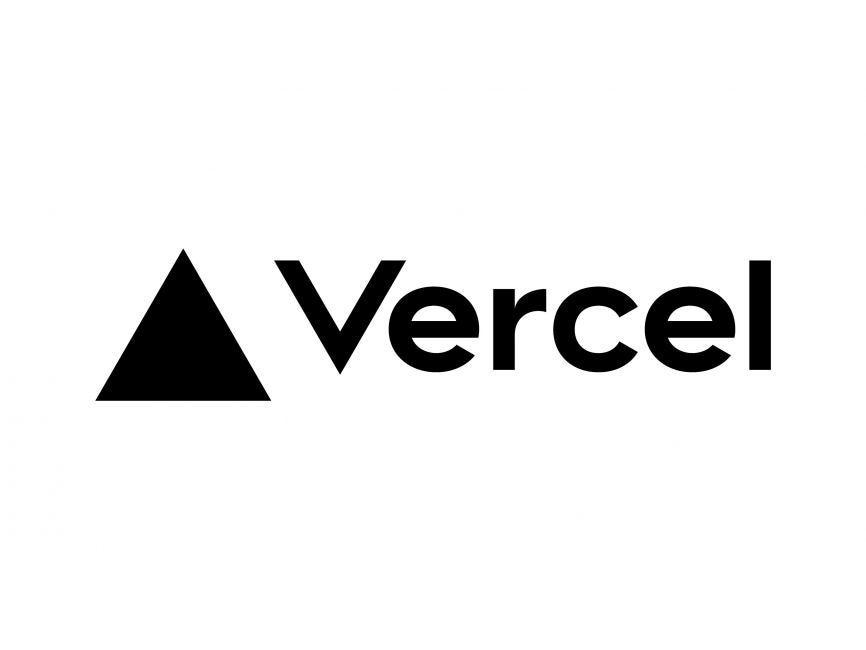
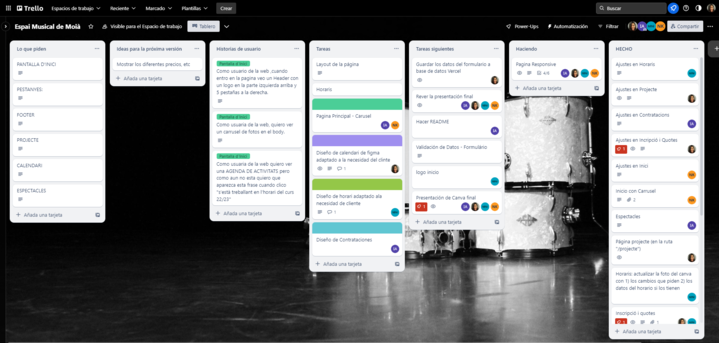
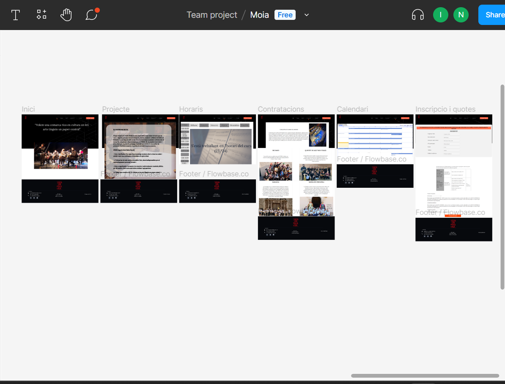

## 

## [Sitio Web](https://web-omega-swart.vercel.app/)
El Espai Musical de Moià (EMM) es una cooperativa sin ánimo de lucro que tiene como objetivo principal democratizar la práctica musical y artística de Moià y el Moianès. La participación de los socios y sus intereses musicales y artísticos son el motor de crecimiento y desarrollo del EMM. Es un proyecto innovador y joven, creado por un grupo de pedagogos musicales que sentían la necesidad de promover la actividad musical en la población de Moià y su comarca. El EMM sigue dos líneas de acción: como facilitador de un espacio de aprendizaje musical, abierto a todas las edades y niveles y con políticas económicas de gran alcance.

## Funcionalidades Principales
Algunas de nuestras funcionalidades principales incluyen:
- Descripciòn del proyecto.
- Detalles completos de cada servicio musical.
- Una agenda de actividades.
- Un formulario para inscribir.
- Una tabla de cuotas .

## Colaboradores

| [Minerva](https://github.com/Minerva1922)                                                | [Jhoana](https://github.com/JhoanaVicente)                                          | [Ikram](https://github.com/ikramadam)                                     | [Nelly](https://https://github.com/NellyKaykay)                           |
|-----------------------------------------------------------------------------|-----------------------------------------------------|---------------------------------------------------------------------------|---------------------------------------------------------------------------|
|  |  |  |  |

 

## Tecnologías y Herramientas Utilizadas

 
  
  

## Instalación
 
 - Clona o descarga el [repositorio](https://github.com/Espai-Musical-de-Moia/web.git) del proyecto en tu máquina local.
 - Instala las dependencias del proyecto usando `npm install`.
 - Lanza el servidor de desarrollo haciendo `npm run dev`.

## Trello
 
(https://trello.com/b/oTBCpfNQ/espai-musical-de-moi%C3%A0)

## Figma
 
(https://www.figma.com/file/GScryEnaRixBHVyGoQDbNV/Moia?type=design&node-id=0-1&mode=design&t=cl3l6BVzHgJmHhiz-0)

